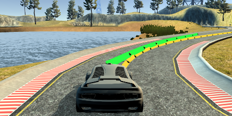
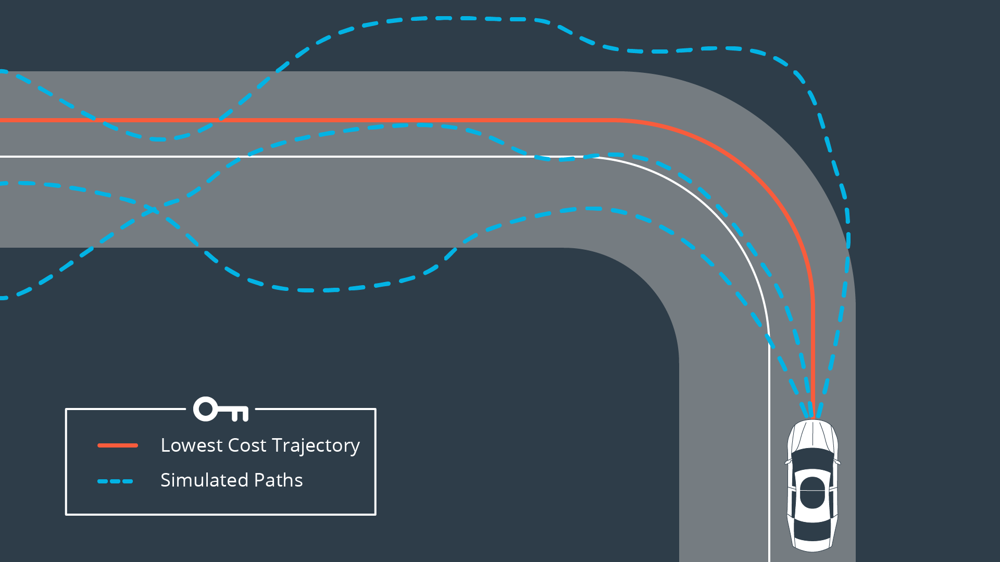
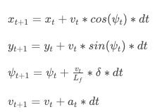
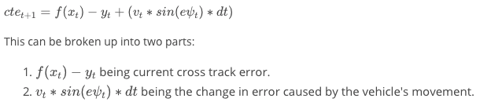
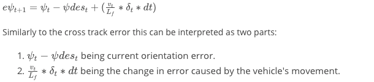

# Model Predictive Control 

Implement Model Predictive Control to drive the car around the track. 

(Displaying the MPC trajectory path in green, and the polynomial fitted reference path in yellow.)

* `DATA.md` - description of the data sent back from the simulator
* `lake_track_waypoints.csv` file has the waypoints of the lake track and can be used to fit polynomials and points and see of how well the model tracks curve
* `quizzes` - quizzes for vehicle models and model predictive control sections
* `src` - MPC implementation

([source for notes below ](https://www.udacity.com/drive))

## Kinematic vs Dynamic Models
                   
 |  
:---------:| :---------: 

The vehicle in the left image is forced off the road due to forces not accounted for. On the right, the dynamic model is able to stay on the road, knowledge of forces is embedded in the model. 

Kinematic models are simplifications of dynamic models that ignore tire forces, gravity, and mass. This simplification reduces the accuracy of the models, but it also makes them more tractable. At low and moderate speeds, kinematic models often approximate the actual vehicle dynamics.

Dynamic models aim to embody the actual vehicle dynamics as closely as possible. They might encompass tire forces, longitudinal and lateral forces, inertia, gravity, air resistance, drag, mass, and the geometry of the vehicle. Not all dynamic models are created equal! Some may consider more of these factors than others. Advanced dynamic models even take internal vehicle forces into account - for example, how responsive the chassis suspension is.

* [Kinematic and Dynamic Vehicle Models for Autonomous Driving Control Design](http://www.me.berkeley.edu/~frborrel/pdfpub/IV_KinematicMPC_jason.pdf)
* [Pacejka Tire Model](http://www.theoryinpracticeengineering.com/resources/tires/pacejka87.pdf): also known as the Magic Tire Formula.

## PID vs MPC Control

In a real car, an actuation command won't execute instantly - there will be a delay as the command propagates through the system. A realistic delay might be on the order of 100 milliseconds.

This is a problem called "latency", and it's a difficult challenge for some controllers - like a PID controller - to overcome. But a Model Predictive Controller can adapt quite well because we can model this latency in the system.

### PID Controller

PID controllers are great (given proper tuning) at evaluating an error at a given time and returning a good actuation value. The issue arises in a realtime setting with latency, that is, it's likely the state from which the error was calculated has changed before the actuation is actually performed. This typically ends up with the controller overshooting, the effect gradually worsening with time.

It's possible for a PID controller to compute an actuation value based on a future error, but, without knowledge of the actual model it's unlikely this will be accurate.

### MPC Controller

A Model Predictive Controller can plan well into the future, on the order of seconds. It's because this small amount of latency naturally doesn't affect MPC like it does PID control. Additionally due to knowledge of the model, we can pretend the initial state isn't the current state but rather a future state t time from now. Another option would be to select a future actuation rather than the first, which is what's done by default.

Thus, MPC can deal with latency much more effectively than a PID controller, which becomes essential in realtime scenarios.

## Overview

Model Predictive Control (MPC) involves simulating actuator inputs. This process is done several times resulting in several trajectories. The trajectory associated with the lowest cost is chosen. The simulated trajectories are based off the initial state and the model's dynamics, constraints and, of course, the cost function.

Ultimately only the initial actuations resulting the lowest cost trajectory are executed. This brings the vehicle to a new state (now the initial state) and the process is repeated.

Here is the MPC algorithm - 

Setup:

1. Define the length of the trajectory, N, and duration of each timestep, dt.
2. Define vehicle dynamics and actuator limitations along with other constraints.
3. Define the cost function.

Loop:

1. We pass the current state as the initial state to the model predictive controller.
2. We call the optimization solver. Given the initial state, the solver will return the vector of control inputs that minimizes the cost function. The solver we'll use is called [Ipopt](https://projects.coin-or.org/Ipopt).
3. We apply the first control input to the vehicle.
4. Back to 1.

### Implementation

1. Describe the model in detail, includes the state, actuators and update equations.

To keep track of the state of a vehicle, we need:
* x, y - the position of the vehicle in the map coordinate
* psi - the orientation of the vehicle
* v - the velocity of the vehicle
* cte - (cross track error) the error between the center of the road and the vehicle's position 
* epsi - (orientation error) current orientation error and the change in error caused by the vehicle's movement

To derive a model that captures how the states evolves over time we use an actuator. Most cars have three actuators: the steering wheel, the throttle pedal and the brake pedal. For simplicity we'll consider the throttle and brake pedals as a singular actuator, with negative values signifying braking and positive values signifying acceleration.

To predict how the state changes over time based on the previous state and current actuator inputs: 

A typical autonomous vehicle system starts with the perception system, which estimates the state of the surrounding environment, including landmarks and vehicles and pedestrians. The localization block compares that model to a map to figure out where the vehicle is. The path planning block charts a trajectory, using the environmental model, the map, and vehicle location. Finally, the control loop applies the actuators to follow this trajectory. Typically, the path planning block passes the reference trajectory to the control block as a polynomial. Third-degree polynomials are common since they can fit most roads.

2. Discuss the reasoning behind the chosen N (timestep length) and dt (timestep frequency) values.

3. Discuss the polynomial fitting to waypoints and MPC preprocessing (waypoints, the vehicle state, and/or actuators).

4. Discuss how to deal with latency.

