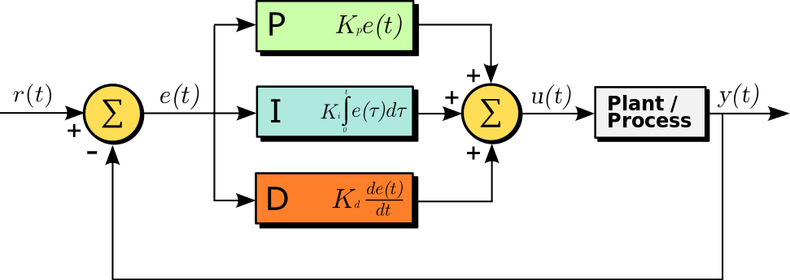
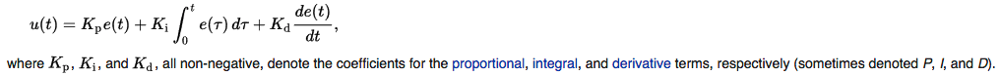
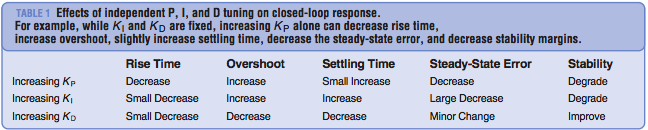

# PID Controller

Implement a PID controller to race around the lake track. 

([source](https://en.wikipedia.org/wiki/PID_controller#/media/File:PID_en.svg): A block diagram of a PID controller in a feedback loop. r(t) is the desired process value or "set point", and y(t) is the measured process value.)

## [Fundamental Operation](https://en.wikipedia.org/wiki/PID_controller)

A PID controller continuously calculates an error value {\displaystyle e(t)} e(t) as the difference between a desired setpoint and a measured process variable and applies a correction based on proportional, integral, and derivative terms. The controller attempts to minimize the error over time by adjustment of a control variable {\displaystyle u(t)} u(t), such as the position of a control valve, a damper, or the power supplied to a heating element, to a new value determined by a weighted sum:

In this model:

* P accounts for present values of the error. For example, if the error is large and positive, the control output will also be large and positive.
* I accounts for past values of the error. For example, if the current output is not sufficiently strong, the integral of the error will accumulate over time, and the controller will respond by applying a stronger action.
* D accounts for possible future trends of the error, based on its current rate of change.

As a PID controller relies only on the measured process variable, not on knowledge of the underlying process, it is broadly applicable. By tuning the three parameters of the model, a PID controller can deal with specific process requirements. The response of the controller can be described in terms of its responsiveness to an error, the degree to which the system overshoots a setpoint, and the degree of any system oscillation. The use of the PID algorithm does not guarantee optimal control of the system or even its stability.

Some applications may require using only one or two terms to provide the appropriate system control. This is achieved by setting the other parameters to zero. A PID controller is called a PI, PD, P or I controller in the absence of the respective control actions. PI controllers are fairly common, since derivative action is sensitive to measurement noise, whereas the absence of an integral term may prevent the system from reaching its target value.

## Reflection

* Describe the effect each of the P, I, D components had in the implementation.

P controls the proportional correction of the cross track error, larger value increases oscillation therefore decreases stability. I helps the car stay in the middle of road but larger value causes instability. D speeds up the corrections time and improves stability. Below is a summary of general effects of independent P, I, and D tuning on closed-loop response from [PID control system analysis and design](http://eprints.gla.ac.uk/3815/1/IEEE_CS_PID_01580152.pdf):    

* Describe how the final hyperparameters were chosen.

The final parameters reflect a PD controler with "I" set to 0. They were choosen through a manual tuning process (Ziegler-Nichols Method) discussed in the resources below. 

## Resources

* [PID control system analysis and design](http://eprints.gla.ac.uk/3815/1/IEEE_CS_PID_01580152.pdf)
* [The Basics of Tuning PID Loops](https://innovativecontrols.com/blog/basics-tuning-pid-loops)
* [PID_controller#Loop_tuning](https://en.wikipedia.org/wiki/PID_controller#Loop_tuning)
* [Effects of PID Controller on a Closed Loop Feedback System](https://www.researchgate.net/publication/269764111_Effects_of_PID_Controller_on_a_Closed_Loop_Feedback_System)
